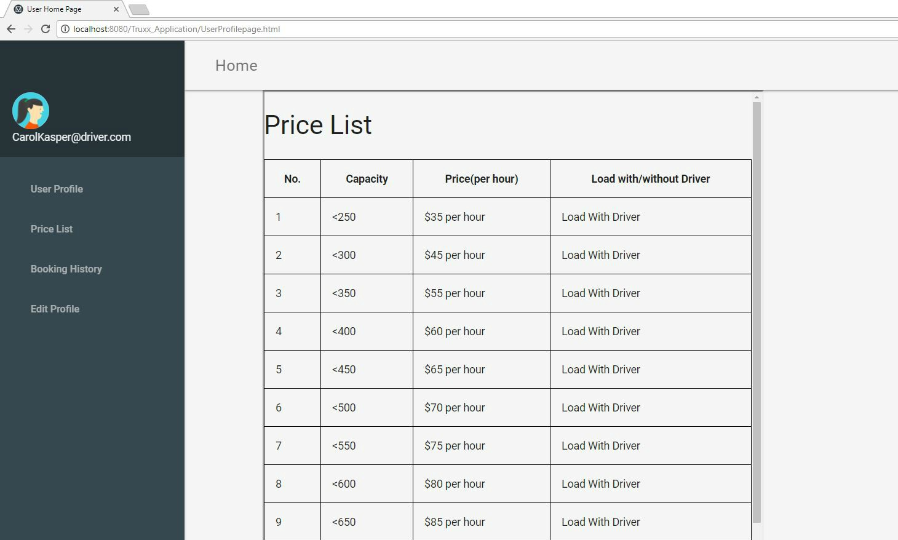
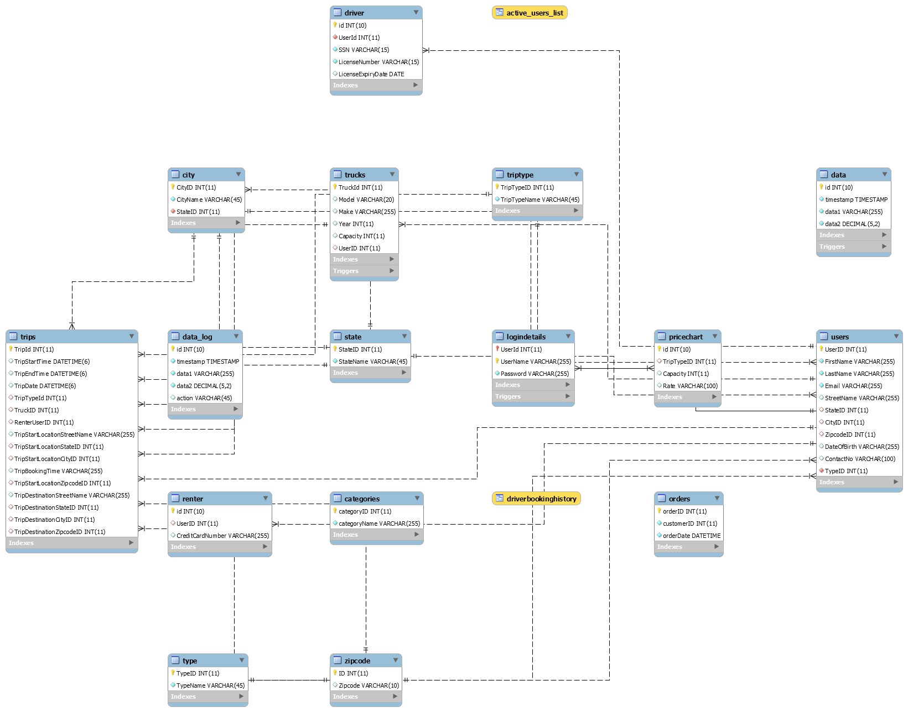

# Truxx
The project is an full stack implementation including database design for the truxx.com.


## Index

## Setup and Run

* Netbeans IDE and Glassfish server installation
  
  Follow the link https://docs.oracle.com/cd/E21454_01/html/821-2531/gknen.html for the installation.
  
* MySQL database setup and run

  Using the Truxx_Dump.sql file to import database in your MySQL server. 
  

  
## Development Starting Point and Framework

* Frontend (HTML, Materialized CSS, Vanilla JavaScript, jQuery)
  
* Backend (Java, Jersey for REST API)
  
  
## Business Rules and Assumptions

The system support two kinds of user to login, *renter*, and *driver*. 
Every User should create a user account and then and only then will they be able to access the system.
The system users should be of the legal age, that is, above 18.
Once a user deactivates their account they will not be able to reactivate it and all data related to them is lost forever.
A registered driver should have a valid driver’s license and must be medically fit to drive and carry heavy objects.
The trucks that needs to be registered have to be in running and good condition.
The driver’s share would be fixed and would be credited bi-weekly to his account on the basis of the trips(miles) he has covered over the fortnight.
How much the user has to pay for the truck he would want to rent with/without Driver load/unload assistance is determined as per Company policies.
Once booked and charged, no refund shall be processed even if the trip has been cancelled.


### Full Use Case

Users (renters/drivers) can register and login to the system, as well as update and view their details. Drivers should register their trucks while registering themselves to the system. 
Renters shall be able to book a trip, and drivers shall have an option of accepting/declining the trip.
The User's can view their booking history details. Users also should be able to update and delete their profiles.

<p align='center'>
  
  
</p>


### Implemented Parts

We have implemented the database for the full use case, that includes 12 Tables with generalizaiton/specialization relationship. User can register and login to the system. Renter can **book a trip** and **view their booking history**. Driver can also **view their booking history**. Users can **view the Price list**. Users can **update and delete** their profiles.

## Web UI 

The frontend uses HTML5, Vanilla JavaScript and Materialize CSS.

### Login Screen/Home page of Application

<p align='center'>

</p>

### Profile View for User
<p align='center'>

</p>

<p align='center'>

</p>

### UI for Renter to enter Payment Details
<p align='center'>

</p>


### Edit Profile Page
<p align='center'>

</p>


### Price List View
<p align='center'>
  
</p>

### Truck Booking UI
<p align='center'>
  
</p>

### Trip Confirmation Page, Logout Button and Delete Profile Button
<p align='center'>
  
</p>

### Booking History for User
<p align='center'>
  
</p>

## EERD

The database “truxx” has been design to have 12 tables, with the below listed assumptions and rules
- The trip can be anywhere in Charlotte city and it  is the only city we are considering for our application. And hence the State is always North Carolina.
- The Driver would need his SSN and Driving License Number in order to successfully register and that data is stored in the driver table.
- Each renter is assigned with a driver by the system. 
- The trip booking has a specific fare associated and varies with respect to the capacity of the truck and if loading/unloading option has been availed.
- Trip table has all the details about the trip undertaken.

<p align='center'>
   
</p>

### Generalization / Specialization
Users table has two types renter and driver.

## Data Dictionary
<p align='center'>
   
   
</p>

<p align='center'>
   
   
</p>


## SQL Implementation Details

### Stored Procedure
#### Stored Procedure 1 
This stored procedure helps calculate the earnings for the driver as the name of the procedure suggests.
```mysql
CREATE DEFINER=`root`@`localhost` PROCEDURE `DriverEarnings`(IN param1 INT)
BEGIN 
Select p.Rate from truxx.trucks t,truxx.pricechart p where t.UserID= param1 and t.Capacity=p.Capacity;
END ;
```

#### Stored Procedure 2
This stored procedure helps fetch trip details, matching the firstname and lastname. Gives away all the details of the trips undertaken under the specific name.
```mysql
CREATE DEFINER=`root`@`localhost` PROCEDURE `retrieveTripDetails`(
in first_Name varchar(255),
   in last_Name varchar(255))
BEGIN
select *
   from trips
   where RenterUserID in
(
select UserID
           from users
           where FirstName = first_Name and
           LastName = last_Name
);
END ;

```
#### Stored Procedure 3
This stored procedures assists in calculating the rate for this entire trip depending on the duration of the trip, using the function ‘calculateTimeDiff’ and along with it considers the type of the trip ( with and without driver) and the capacity of the truck ( staring from 250 units and the price starts from 35$)

```mysql
CREATE DEFINER=`root`@`localhost` PROCEDURE `calculateRate`(
in start_time datetime,
   in end_time datetime,
   in cap int,
   in triptype int,
   out rateVal float)
BEGIN
declare hours float(22);
   set hours = calculateTimeDiff(start_time, end_time);
   
   select (hours * (
select rate
                   from pricechart
                   where capacity = cap and
                   TripTypeID = triptype)) into rateVal;
END ;


```
### Trigger
#### Trigger 1
This trigger deletes and updates all the relevant records from trips, renter, trucks, driver,users table if the login details are deleted for that particular entry
 ```mysql
 CREATE DEFINER=`root`@`localhost` TRIGGER Delete_trigger AFTER DELETE ON logindetails
	FOR EACH ROW
	BEGIN
    delete from trips where RenterUserID=OLD.userID;
    delete from renter where UserID=OLD.userID;
     delete from trucks where UserID=OLD.userID;
    delete from driver where UserID=OLD.userID;
    delete from users where UserID=OLD.userID;
	END
  ```
 
 #### Trigger 2
 ```mysql
CREATE DEFINER=`root`@`localhost` TRIGGER `truxx`.`trucks_BEFORE_DELETE` BEFORE DELETE ON `trucks` FOR EACH ROW
BEGIN
delete from trips where TruckID=OLD.TruckId;
END
 ```
### Function
This function calculates the duration of the trip by considering start time and end time of the trip in hours.
```mysql
CREATE DEFINER=`root`@`localhost` FUNCTION `calculateTimeDiff`(start_time datetime, end_time datetime) RETURNS float
BEGIN
declare hours float;
set hours = 0;
select timestampdiff(HOUR, start_time, end_time) into hours;
RETURN hours;
END ;
```
### View

This View has been created to reduce the load on the Database, whenever queried with respect to the Trip details for the particular driver. This view gets all the details of the driver, trips he had finished, the address where he picked and dropped off the renter.

 ```mysql
 
 CREATE VIEW `driverbookinghistory` AS SELECT 
1 AS `TripStartTime`,
1 AS `TripEndTime`,
1 AS `FirstName`,
1 AS `LastName`,
1 AS `TripStartLocationStreetName`,
1 AS `TripDestinationStreetName`,
1 AS `TripTypeName`;
 
 ```

## Future Work
We are looking to implement following functionalities for the future work:

1. Drivers will have the option to accept/cancel the trip in a particular time windows. It will give flexibility to drivers according to their work schedule.
2. Payment gateway integration to collection amount from renter with bank accounts.
3. We will configure monthly fee charges for the driver to keep their truck visible on the website.
4. There will be an initial registration fee for drivers.
5. Background verification will be performed to check the validation of driving license, vehicle registration, and SSN details.
6. We are looking to add advertisement on the website home page to generate revenue for our project.
7. We are also looking to add an option for the user to register as both driver and renter.
8. Google location map will be implemented to book a trip. It would be easier to have latitude and longitude for booking trip details.
9. The mobile app version of this web application.


## References
* https://www.w3schools.com/sql/
* http://materializecss.com/
* https://www.tutorialspoint.com/restful/index.htm


